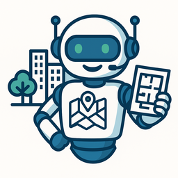

# AI-Powered Municipal Assistant: Chatbot for IMPLAN Delicias

  

This repository contains the source code and documentation for an intelligent virtual assistant developed for the Municipal Planning Institute (IMPLAN) of Delicias, Chihuahua. This project is more than a chatbot; it is a full-fledged Business Intelligence solution designed to automate public information access, enhance citizen engagement, and optimize internal resources.

  

> *A live demonstration of the chatbot in action on the official IMPLAN website. For try the ChatBot visit [(http://implandeliciaschih.ddns.net/)]*

---

## Project Vision: Beyond Code, a BI Solution

As a Senior Business Intelligence professional, my primary goal was not merely to build an application, but to solve a core business problem: **bridging the gap between the vast amount of municipal planning data and its accessibility to the average citizen.**

The challenge was to transform complex, unstructured documents—such as development plans, official gazettes, and risk analyses—into instant, comprehensible answers available 24/7. This chatbot serves as a direct data pipeline from IMPLAN's knowledge base to the community's questions, turning static information into a dynamic, interactive service.

---

## Technical Architecture

To deliver a robust, scalable, and real-time solution, I designed and implemented a three-tiered architecture that decouples presentation, logic, and intelligence. This modular approach ensures easy maintenance and future scalability.

graph TD
    A[Frontend: Vanilla JS on IMPLAN Website] -- "User Query (POST Request)" --> B{Backend: Python/Flask API};
    B -- "Enrich Query + Context" --> C[Intelligence Layer: Google Gemini API];
    C -- "Generated Response" --> B;
    B -- "Formatted Answer (JSON)" --> A;
    
**Frontend (UI):** A clean, responsive chat interface built with HTML5, CSS3, and Vanilla JavaScript. Asynchronous communication with the backend is handled via the Fetch API, ensuring a seamless user experience.
**Backend (Logic Core):** A lightweight yet powerful microservice developed in Python with the Flask framework. This API is the operational heart, orchestrating the entire request-response cycle.
**Intelligence Layer (External API):** The Google Gemini Pro model, integrated via its API. I employed a Retrieval-Augmented Generation (RAG) architecture to ensure all responses are grounded in factual, provided data, mitigating AI "hallucinations."

## My Role & Development Process: A Full-Stack Approach
I managed this project end-to-end, from data engineering to final deployment, applying a wide spectrum of technical skills.

1. Knowledge Base Engineering (The BI Perspective)
The foundation of any intelligent system is its data. I executed a classic ETL process to build the chatbot's brain:
**Extract:** Pulled unstructured text from the IMPLAN website, internal HTML pages, and linked PDF documents.
**Transform:** Structured the extracted information into a coherent JSON format, creating a domain-specific knowledge base.
**Load:** This JSON context is loaded at runtime and injected into the AI's prompt for every query.

## 
► Click to see an example of the structured Knowledge Base

code
JSON
{
  "about": "El Instituto Municipal de Planeación (IMPLAN) de Delicias tiene por objeto fortalecer la planeación participativa estratégica...",
  "contact": {
    "address": "Calle Cuarta Norte N°8, Colonia Centro, Delicias, Chihuahua...",
    "email": "implan@delicias.gob.mx",
    "phone": "639 6882650"
  },
  "documents_and_services": [
    {
      "title": "Plan Municipal de Desarrollo de Delicias 24-27",
      "href": "https://chihuahua.gob.mx/...",
      "summary": "Este es el documento que rige el desarrollo municipal para el periodo 2024-2027..."
    }
  ]
}

## 2. Backend & API Development
I built the /chat endpoint using Flask, focusing on robustness and clarity. The Python logic does more than just proxy requests; it enriches the user's query with the knowledge base context, demonstrating my ability to design and build purposeful APIs.

► Click to see a snippet of the Flask backend code

code
Python
# chatbot_backend.py
import google.generativeai as genai
from flask import Flask, request, jsonify

app = Flask(__name__)

# The system prompt instructs the AI on its personality and constraints
system_prompt = f"""
Eres un asistente virtual amable y servicial del IMPLAN de Delicias, Chihuahua.
Tu nombre es 'Planito'. Responde únicamente basándote en la siguiente información:
{knowledge_base_json}
"""

model = genai.GenerativeModel(model_name="gemini-1.0-pro")

@app.route('/chat', methods=['POST'])
def chat():
    try:
        data = request.get_json()
        user_question = data.get("question")

        if not user_question:
            return jsonify({"error": "No question provided."}), 400
        
        # Start a chat session with the system instructions and user's query
        convo = model.start_chat(history=[...]) # History includes the system_prompt
        convo.send_message(user_question)
        
        return jsonify({"answer": convo.last.text})

    except Exception as e:
        print(f"Error in /chat endpoint: {e}")
        return jsonify({"error": "Internal server error."}), 500

if __name__ == '__main__':
    # Listens on all available network interfaces
    app.run(host='0.0.0.0', port=5000, debug=True)

# The system prompt instructs the AI on its personality and constraints
system_prompt = f"""
Eres un asistente virtual amable y servicial del IMPLAN de Delicias, Chihuahua.
Tu nombre es 'Planito'. Responde únicamente basándote en la siguiente información:
{knowledge_base_json}
"""

model = genai.GenerativeModel(model_name="gemini-2.5-pro")

@app.route('/chat', methods=['POST'])
def chat():
    try:
        data = request.get_json()
        user_question = data.get("question")

        if not user_question:
            return jsonify({"error": "No question provided."}), 400
        
        # Start a chat session with the system instructions and user's query
        convo = model.start_chat(history=[...]) # History includes the system_prompt
        convo.send_message(user_question)
        
        return jsonify({"answer": convo.last.text})

    except Exception as e:
        print(f"Error in /chat endpoint: {e}")
        return jsonify({"error": "Internal server error."}), 500

if __name__ == '__main__':
    # Listens on all available network interfaces
    app.run(host='10.10.5.0', port=5000, debug=True)

## 3. Frontend Implementation
I developed the chatbot's UI from scratch for seamless integration. The client-server logic, written in clean Vanilla JavaScript, highlights my competency in frontend development and asynchronous programming.

► Click to see a snippet of the frontend JavaScript

code
JavaScript
// Part of the sendMessage function in the main HTML file

const sendMessage = async () => {
    const question = chatInput.value.trim();
    if (question === '') return;

    // Display user message immediately for a responsive feel
    displayMessage(question, 'user-message');
    chatInput.value = '';

    try {
        // Asynchronously call the backend API endpoint
        const response = await fetch('http://implan-chat.strangled.net:5000/chat', {
            method: 'POST',
            headers: { 'Content-Type': 'application/json' },
            body: JSON.stringify({ question: question })
        });

        if (!response.ok) throw new Error(`Server error: ${response.status}`);

        const data = await response.json();
        // Display the AI's answer received from the backend
        displayMessage(data.answer, 'bot-message');

    } catch (error) {
        console.error("Error contacting the bot:", error);
        displayMessage('Sorry, I am having trouble connecting. Please try again later.', 'bot-message');
    }
};

## 4. Deployment & Systems Administration
Deploying this solution on a physical, on-premise server presented real-world challenges that I successfully navigated:
Network Configuration: Engineered a resilient solution for a dynamic public IP address by setting up a DDNS service (FreeDNS) and configuring Port Forwarding rules on the network router.
Server Hardening: Secured the server by configuring the Windows Firewall to allow traffic exclusively on the application's port (5000/TCP), ensuring both accessibility and security.
Environment Management: Resolved dependency conflicts and managed the Python environment to ensure the script runs consistently and reliably as a service.
Core Competencies & Tech Stack

## This project is a practical demonstration of my expertise across the full data and development lifecycle.

## Category	Technologies & Skills

**Backend Development**	Python, Flask, RESTful API Design

**Frontend Development**	JavaScript (ES6+), HTML5, CSS3, DOM Manipulation, Fetch API (AJAX)

**Artificial Intelligence**	Google Gemini API, Prompt Engineering, Retrieval-Augmented Generation (RAG)

**Systems & Networking**	Windows Server, Firewall Configuration, Port Forwarding, DDNS, SSH

**BI & Data Engineering**	ETL Processes, Data Structuring (JSON), Solution Architecture, Problem Solving

## Contact
This chatbot is a tangible example of how technology, when applied with a Business Intelligence strategy, can transform data into direct value for an organization and its community. 
I am proud of the result and eager to apply these skills to new and complex challenges.
Feel free to reach out if you'd like to learn more about this project or discuss potential collaborations.

LinkedIn: ]
